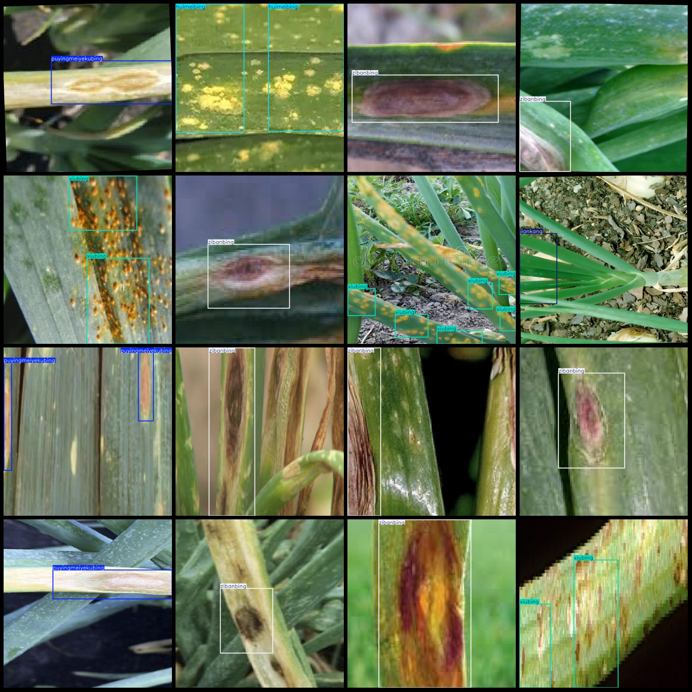
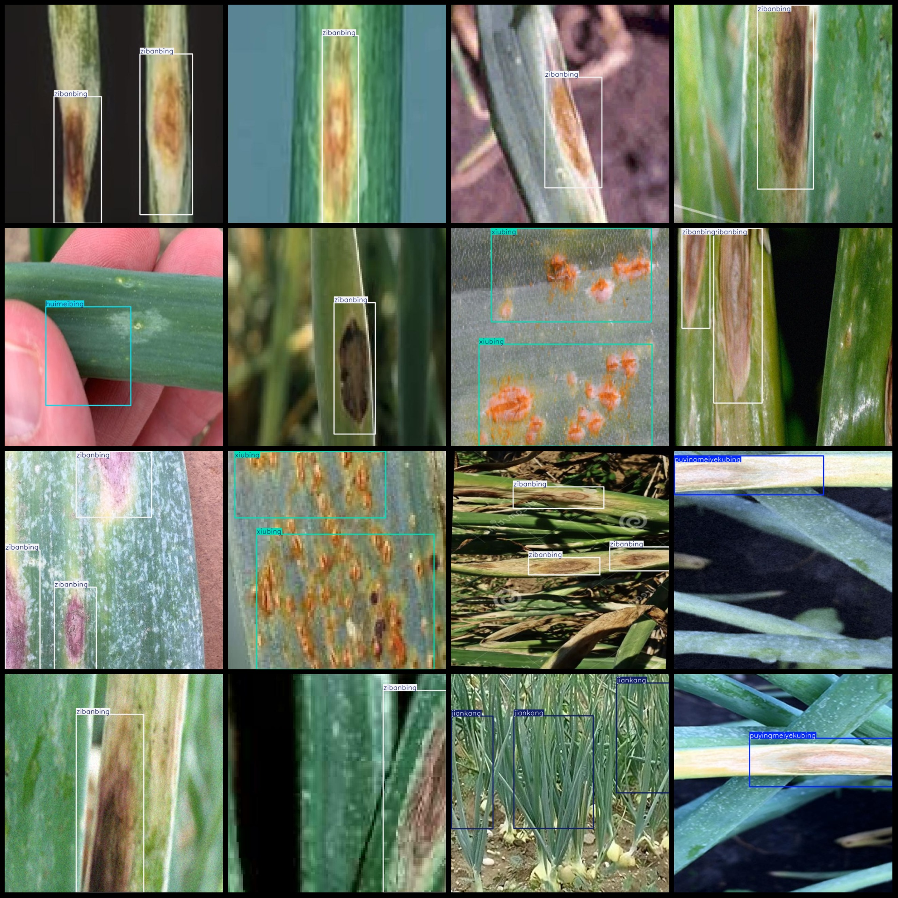

# Vegetable Disease and Pest Detection Dataset (VOC+YOLO) with 333 images in 5 categories

Dataset format: Pascal VOC format + YOLO format (txt file without split path, only contains jpg images and corresponding VOC format xml files and yolo format txt files)
Number of images (jpg file count): 333
Number of annotations (xml file count): 333
Number of annotations (txt file count): 333
Number of annotation categories: 5
Annotation category names (note that the order of categories in the yolo format is not consistent with this, but is based on the labels folder's classes.txt): ["huimeibing", "jiankang", 
"puyingmeiyekubing", "xiubing", "zibanbing"]
["Purple blotch disease", "Botrytis disease", "Ustilaginoid leaf blight", "Rust", "Health"]
Number of bounding boxes per category:
huimeibing: 49
jiankang: 31
puyingmeiyekubing: 109
xiubing: 88
zibanbing: 208
Total bounding box count: 485
Number of images per category:
huimeibing: 24
jiankang: 22
puyingmeiyekubing: 94
xiubing: 37
zibanbing: 163
Image resolution: 640x640
Annotation tool used: labelImg
Annotation rules: draw bounding boxes for each category
Important note: The dataset does not include any split for training, validation, or testing; you need to manually divide it.
Special declaration: This dataset does not guarantee any accuracy of the trained models or weight files.
Image preview:
Image

Here is a pay link on Stripe ( https://buy.stripe.com/3cs8yP7sY87d0vu9AB ). Please contact me lonlonago@foxmail.com after funding $89, and I will send you a complete data files , thank you!

